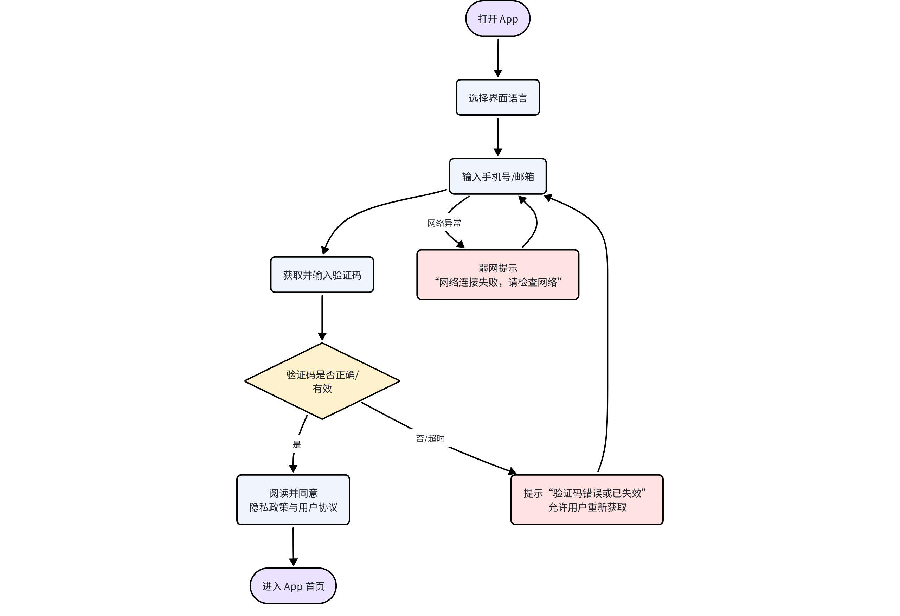
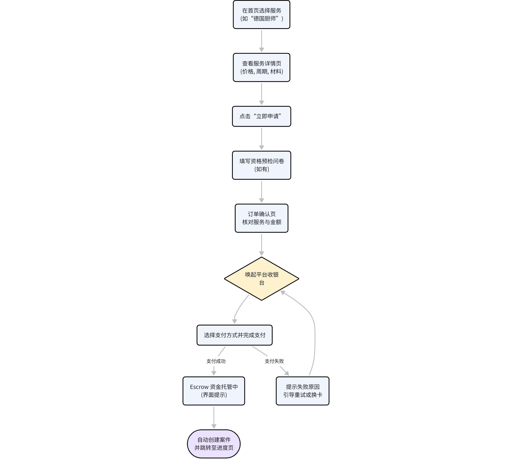
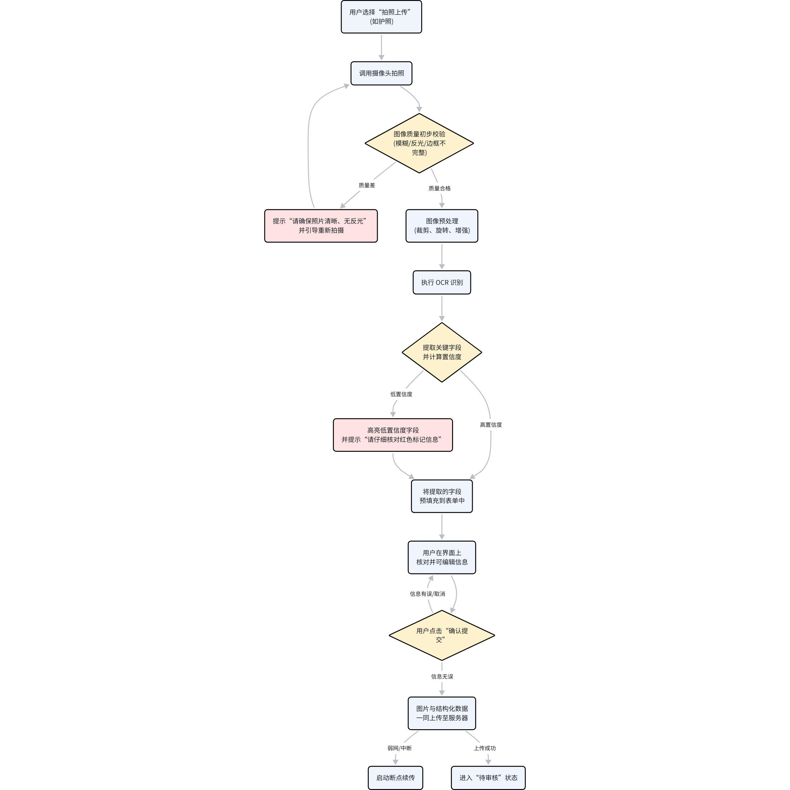
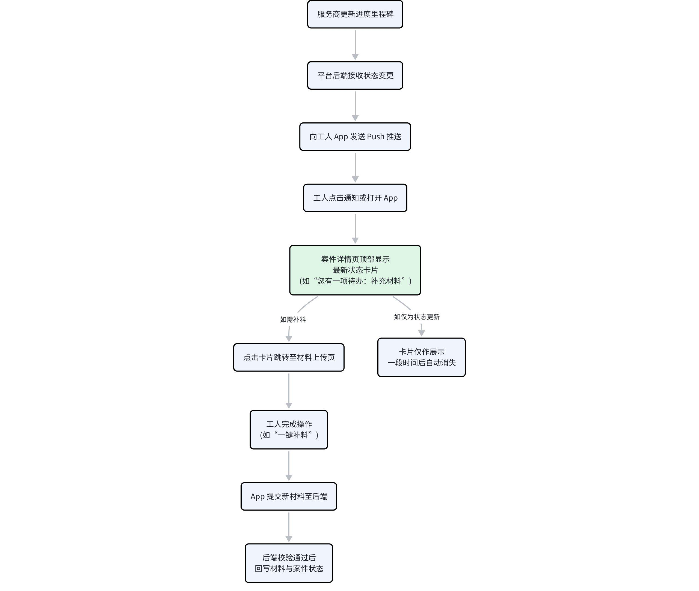
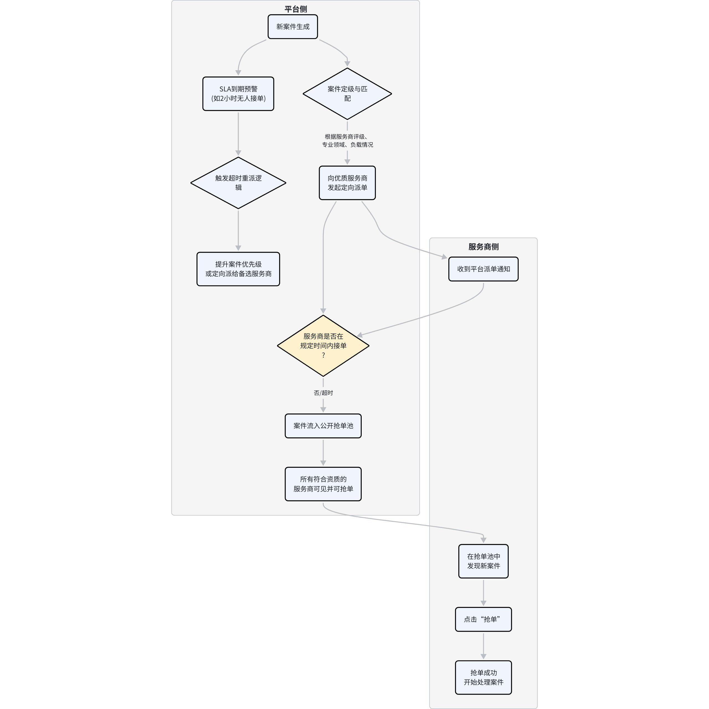
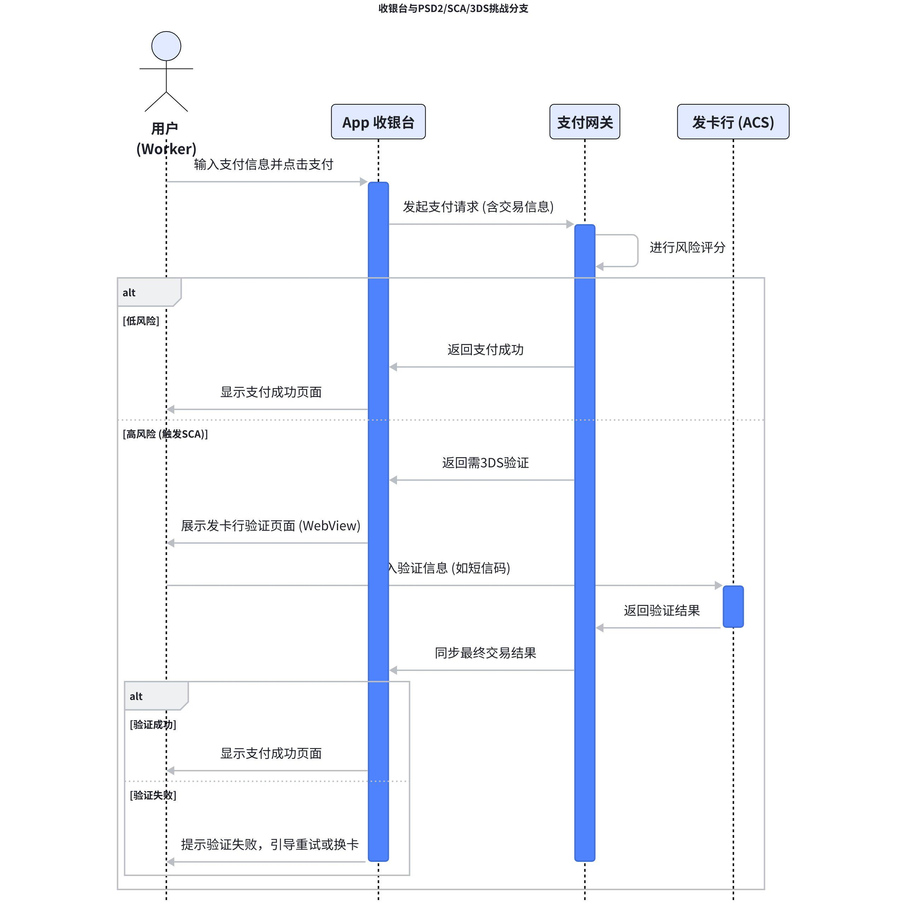

# 出海签证与招聘平台产品需求文档 (PRD)
## 1. 产品概述

### 1.1. 产品定位与目标

本产品是一个垂直领域的综合服务平台，旨在连接全球蓝领工人、海外雇主（以欧洲为主）和专业签证服务商。平台致力于解决当前市场中信息不对称、流程复杂、信任缺失的核心痛点，为三方用户创造一个透明、高效、安全的服务与交易环境。

**核心价值主张**:

- **对工人/求职者**: 提供一个清晰、简单、安全的海外求职与签证办理通道，降低出海门槛。

- **对企业/雇主**: 打造一个高效、精准的海外蓝领人才招聘渠道，并提供签证流程协助。

- **对签证服务商**: 提供稳定的客户流量来源和标准化的在线案件管理工具，提升服务效率。

### 1.2. 目标用户画像

| 角色 | 核心特征 | 痛点与需求 |
| --- | --- | --- |
| **蓝领工人/求职者** | 年龄：25-45岁 职业：厨师、建筑工、护理、电工等 特点：技能扎实，但语言、信息渠道、流程熟悉度有限 | **痛点**: 信息不对称、流程繁琐、语言障碍、担心费用安全、害怕被骗。 **需求**: 真实可靠的职位、清晰透明的办理流程、实时的进度反馈、安全的资金保障。 |
| **企业/雇主** | 类型：海外餐厅、建筑公司、工厂、护理机构等 地点：以德国等欧洲国家为主 特点：有用工缺口，但缺乏高效的跨国招聘渠道 | **痛点**: 招聘渠道有限、候选人筛选难、签证流程不熟、跨国沟通成本高。 **需求**: 发布招聘信息、高效筛选匹配的候选人、获得签证办理协助。 |
| **签证服务商** | 类型：持牌移民律师、签证中介、咨询公司 特点：具备专业资质，但获客方式传统 地点：分布在全球各地，以目标国家为主 | **痛点**: 获客成本高、案件管理混乱、客户沟通效率低、服务流程非标。 **需求**: 稳定的客户来源、标准化的案件管理工具、便捷的在线沟通与材料审核。 |

### 1.3. 产品路线图 (Roadmap)

### MVP (P0)
- **核心目标**: 验证核心业务闭环
- 用户认证与角色体系
- 工人签证申请流程 (浏览、申请、支付、进度)
- 服务商发布服务与案件管理
- 基础聊天与支付功能

### V1.0 (P1)
- **核心目标**: 完善招聘与信任体系
- 企业招聘功能闭环
- 简历与人才中心
- AI 助手核心功能
- 双向评价与投诉系统

### V1.5 (P2)
- **核心目标**: 提升服务深度与用户粘性
- 行前准备与到达后支持
- 数据驱动的智能推荐优化
- 高级筛选与批量操作
- 社区与增值服务探索

## 2. 全局功能与设计

### 2.1. 总体信息架构

平台采用模块化设计，以用户角色为中心组织功能。客户端与服务端通过 API 进行数据交互。

**高层架构图**:

### 2.2. 设计原则

- **移动端优先**: 所有界面首先考虑在移动设备上的体验，保证操作便捷。

- **简化操作**: 核心流程（如申请、投递）控制在3-4步内完成，避免用户迷失。

- **视觉化引导**: 广泛使用图标、颜色编码、进度条和时间轴，降低用户的认知负荷。

- **AI 辅助**: AI 助手贯穿整个用户旅程，提供从决策支持到处境帮助的全方位智能服务。

- **双语支持**: 默认支持中文（简体）和英文，所有用户生成内容（UGC）和平台内容均需支持双语录入与展示。

### 2.3. 优先级定义

| **优先级** | **定义** | **说明** |
|----|----|----|
| **P0** | **核心功能 (MVP)** | 缺少该功能会导致核心业务流程无法闭环，产品无法上线。例如：登录、支付、申请。 |
| **P1** | **重要功能 (V1.0)** | 对提升核心用户体验至关重要，能显著增强产品竞争力。例如：招聘功能、双向评价。 |
| **P2** | **优化功能 (V1.5+)** | 用于提升用户粘性、运营效率或扩展服务范围的锦上添花的功能。例如：数据导出、离线模式。 |

## 3. 用户认证与角色 (P0)

### 3.1. 目标与价值

建立安全可靠的用户身份体系，清晰区分三类用户角色，并引导其进入相应的功能模块。

### 3.2. 页面与组件清单

- 启动页

- 登录/注册页

- 角色选择页

- **【补】服务商/企业资质认证页**

- **【补】认证审核状态页**

### 3.3. 核心功能与交互

#### 3.3.1. 登录/注册

- **手机号+验证码**为主要登录方式，符合蓝领用户使用习惯。

- **邮箱+密码**作为备选。

- 支持 **Google、Apple、微信** 等第三方平台授权登录，简化注册流程。

- 注册时必须同意《用户协议》和《隐私政策》。

#### 3.3.2. 角色选择

- 新用户首次登录后，必须选择一个主角色：**工人/求职者**、**服务商**或**企业/雇主**。

- 选择“工人/求职者”后，直接进入App首页。

- 选择“服务商”或“企业/雇主”后，强制进入**资质认证流程**。认证通过前，其核心功能（如发布服务、招聘）将被限制。

#### 3.3.3. 资质认证 (服务商/企业)

- **目标**: 确保平台上的服务商和企业真实、合法，是建立平台信任的基础。

- **服务商认证表单**:

- **企业信息**: 公司全称、营业执照（上传）、统一社会信用代码。

- **运营信息**: 法人代表姓名、法人身份证（上传）、公司官网（选填）。

- **服务资质**: 相关行业的许可证或牌照（如移民顾问牌照，上传）。

- **联系方式**: 官方联系人、联系电话、邮箱。

- **企业认证表单**:

- **企业信息**: 公司全称、营业执照（上传）、所在国家/地区。

- **联系人信息**: HR负责人姓名、联系电话、邮箱。

- **认证审核状态页**:

- **审核中**: 提示“资质信息已提交，预计1-3个工作日完成审核”。

- **审核通过**: 提示“恭喜您，资质认证已通过”，并解锁相关功能。

- **审核拒绝**: 明确展示**拒绝原因**（如“营业执照不清晰”、“许可证已过期”），并提供**重新提交**的入口。

### 3.4. 边界与异常

- **验证码**: 发送失败、接收超时、输入错误次数限制（如5次/小时）。

- **认证失败**: 认证信息被拒绝后，用户可以修改并重新提交，平台记录每次提交和审核结果。

- **角色切换**: 用户可在“个人中心”切换身份，但切换至服务商/企业若未认证，仍需先完成认证。

### 3.5. 验收标准

- 用户可以通过手机号/邮箱/第三方成功登录和注册。

- 新用户登录后能看到角色选择页，并根据选择进入不同路径。

- 服务商/企业用户可以完整填写认证信息并提交审核。

- 用户可以清晰地看到自己的认证状态（审核中/通过/拒绝）及原因。

- 认证未通过时，相关功能（发布服务/招聘）应被锁定。

### 3.6. 埋点与指标

- **注册转化率**: (完成注册用户数 / 进入注册页用户数) \* 100%

- **各角色选择占比**: 工人/服务商/企业选择的用户数。

- **认证提交率**: (提交认证用户数 / 进入认证页用户数) \* 100%

- **一次性认证通过率**: (一次性通过认证的用户数 / 提交认证总用户数) \* 100%

## 4. 签证服务 (P0)

### 4.1. 目标与价值

为用户提供清晰、全面、可信的签证服务信息，帮助用户做出购买决策，并完成在线申请的核心动作。

### 4.2. 页面与组件清单

- 服务列表页

- 服务详情页

- 申请流程页 (三步)

- **【补】材料上传页 (含示例与指引)**

- **【补】进度跟踪页 (使馆阶段细化)**

### 4.3. 核心功能与交互

#### 4.3.1. 服务列表与详情

- **服务卡片 (列表页)**: 需突出 **服务商Logo、认证标识、服务标题、核心卖点标签、关键信息(价格/周期)和评分**，信息层级清晰，便于快速比较。

- **服务详情页**:

- 使用 **Tab** 结构组织内容：服务详情、服务商信息、用户评价。

- **套餐对比表**: 以表格清晰展示不同套餐（基础/标准/尊享）的服务项目差异和价格。

- **服务流程**: 使用 **时间轴** 视觉化呈现从咨询到获签的每一个步骤和预计耗时。

- **所需材料清单**: 分类展示（如基础、学历、工作），并为每项材料提供**点击查看示例图片、详细要求和常见问题**的交互。这是为了解决蓝领用户对材料规格不熟的痛点。

#### 4.3.2. 签证申请流程

- **申请三步**：将复杂的申请过程简化为“**1.填写信息 → 2.上传材料 → 3.确认支付**”三个明确步骤，并提供顶部步骤指示器，让用户时刻了解所处阶段。

- **签证申请三步流程图**:

> 

#### 4.3.3. 材料分阶段收集与指引 (P1 体验优化)

- **目标**: 减轻用户一次性面对大量材料清单的心理压力。

- **交互**:

- 系统引导用户分阶段上传材料。首先是易于获取的基础材料（如护照、身份证），完成后再解锁下一阶段（如工作证明、学历认证）。

- 每一项材料都配有**拍照指引**（如“请将护照完整放入框内，确保文字清晰无反光”）和**标准示例**预览。

- **材料分阶段收集流程图**:

> 

#### 4.3.4. 申请进度跟踪

- **时间轴视图**: 从“已提交”到“已获签”，用时间轴清晰展示申请的每一个状态节点。

- **使馆阶段细化 (P1)**: 将“使馆审核”这个漫长的黑盒阶段细化为 **“材料递交” → “使馆审核中” → “面签预约通知” → “面签完成” → “等待最终结果”** 等子节点，并给出每个阶段的预计等待时间，有效缓解用户焦虑。

### 4.4. 边界与异常

- **服务信息变更**: 服务商修改服务价格或内容后，已下单用户不受影响，但收藏该服务的用户会收到价格变动提醒。

- **材料审核**: 服务商审核用户上传的材料，若不合格，可标记为“需修改”，并填写具体驳回原因（如“照片背景非纯色”）。用户App端收到通知，可重新上传。

### 4.5. 验收标准

- 用户可以流畅地浏览服务列表和详情，信息展示符合设计。

- 套餐对比表、服务流程时间轴、材料清单能够正确渲染。

- 用户可以点击材料项查看示例和要求。

- 申请流程的三步操作连贯，可以成功创建申请订单。

- 材料上传功能支持拍照和相册选择，并能正确显示上传状态。

- 进度跟踪页面能根据订单状态显示正确的时间轴节点。

### 4.6. 埋点与指标

- **服务详情页转化率**: (创建订单用户数 / 访问服务详情页用户数) \* 100%

- **各申请步骤流失率**: 分析用户在“填写信息”、“上传材料”、“确认支付”三个步骤的流失情况。

- **材料一次性通过率**: (首次上传即审核通过的材料数 / 总上传材料数) \* 100%

## 5. 订单与支付 (P0)

### 5.1. 目标与价值

提供安全、可靠、流畅的支付体验，完成商业闭环。同时处理支付过程中的各种异常情况，保障用户和平台的利益。

### 5.2. 页面与组件清单

- 订单确认页

- 支付方式选择

- **【补】支付成功/失败页**

- 订单列表页

- 订单详情页

### 5.3. 核心功能与交互

#### 5.3.1. 订单创建与确认

- 用户在服务详情页点击“立即申请”并完成信息填写后，系统生成一个“待支付”订单。

- 订单确认页清晰列出：服务名称、服务商、套餐类型、服务费用明细、优惠金额（如有）、应付总额。

#### 5.3.2. 支付流程

- 支持主流支付方式，如 **支付宝、微信支付、信用卡/借记卡支付**。

- **分期付款 (P1)**: 对于高客单价服务，可提供3、6、12期等分期选项。

- 用户选择支付方式后，跳转至相应的第三方支付平台完成支付。

#### 5.3.3. 支付失败与异常处理

- **支付失败**: 若支付未能成功（如余额不足、密码错误、网络问题），App内将展示**支付失败页**。

- **页面元素**: 失败原因提示（如“支付遇到问题，请稍后重试”）、失败的订单信息、\*\*“重试支付”\*\*按钮和“选择其他方式”链接。

- **订单保留**: 支付失败的订单状态仍为“待支付”，并为用户保留 **24小时**，超时后自动取消。

- **支付中断**: 用户跳转到支付App后，长时间未操作或手动返回，回到商户App时，应主动向服务端查询支付状态，并根据结果展示相应页面（成功/失败/处理中）。

- **支付失败重试时序图**:

> 

### 5.4. 边界与异常

- **重复支付**: 后端需做幂等性校验，防止因客户端重试导致同一订单重复扣款。

- **退款流程**: 用户可在订单详情页申请退款。退款流程（审核、部分退款、到账通知）需在后台管理系统中详细设计。

- **价格计算器 (P1)**: 在服务详情页提供一个价格计算器工具，用户选择不同服务项（如材料翻译、陪同面签），可实时估算总费用，增加价格透明度。

### 5.5. 验收标准

- 用户可以成功创建订单并进入支付流程。

- 支付成功后，订单状态自动更新为“处理中”，用户收到成功通知。

- 支付失败后，用户能看到失败页面，并能通过“重试”按钮重新发起支付。

- 待支付订单在24小时后被正确地自动取消。

- 订单列表和详情页能准确展示所有订单信息和状态。

### 5.6. 埋点与指标

- **支付成功率**: (支付成功订单数 / 创建订单总数) \* 100%

- **各支付方式占比**: 分析用户对不同支付方式的偏好。

- **支付失败原因分析**: 统计支付失败的类型（用户取消、余额不足、系统错误等）。

## 6. 招聘与求职 (P1)

### 6.1. 目标与价值

为企业和求职者搭建一个高效、真实、低成本的跨国招聘平台，补充和延伸签证服务。

### 6.2. 页面与组件清单

- 招聘列表页

- 招聘详情页

- 简历投递状态反馈

- **【补】个人发布招聘入口与表单**

- 简历管理模块 (见下节)

- 企业中心 (含招聘管理)

### 6.3. 核心功能与交互

#### 6.3.1. 职位浏览与投递

- **招聘列表**: 以卡片流形式展示职位，关键信息（**职位、薪资、地点、福利标签**）一目了然。支持按国家、职位类型、薪资范围等多维度筛选和排序。

- **招聘详情**: 全面展示职位描述、任职要求、薪资福利、公司信息和申请流程。

- **一键投递**: 用户在职位详情页，若简历已完善，可点击“立即投递”一键发送简历。投递后按钮变为“已投递”，并有Toast提示成功。

#### 6.3.2. 个人发布招聘 (P1)

- **目标**: 满足个人雇主（如家庭招聘保姆、管家）的轻量级招聘需求。

- **入口**: 在首页快捷入口和个人中心提供“发布招聘”入口。

- **简化表单**: 相较于企业版，个人发布表单大大简化，仅需填写：

- **职位名称** (如: 住家保姆)

- **工作地点**

- **薪资范围**

- **工作描述** (简单描述工作内容和要求)

- **联系方式**

- **身份验证**: 个人发布者必须完成实名认证（身份证信息），以保证信息真实性。

- **视觉区分**: 在招聘列表和详情页，个人发布的职位会有明确的“个人发布”标识，与“企业认证”职位区分开。

#### 6.3.3. 面试邀约与时区确认

- **背景**: 跨国招聘中，时差是沟通的一大障碍。

- **解决方案**:

- 企业HR在向候选人发起面试邀约时，系统会自动检测双方所在时区。

- 系统会智能推荐几个对双方都合适的面试时间段（例如，北京时间晚上8点，即是柏林时间下午2点）。

- 候选人收到的邀约通知中，时间会自动转换为其本地时间，避免换算错误。

- **面试邀约时序图**:

> 

### 6.4. 边界与异常

- **职位信息审核**: 所有发布的职位（无论是企业还是个人）都需要经过平台审核，杜绝虚假、欺诈信息。

- **简历隐私**: 求职者可以设置简历的公开程度（公开、对认证企业开放、完全隐藏）。

- **投递反馈**: 简历被HR查看、通过筛选、发出面试邀约、不合适等状态，都会通过系统通知实时反馈给求职者。

### 6.5. 验收标准

- 用户可以正常浏览、筛选、搜索招聘职位。

- 用户可以从招聘详情页成功投递简历。

- 个人用户可以通过简化流程发布招聘信息，并完成实名认证。

- 个人发布的职位在前端有明确的视觉标识。

- 企业HR在邀约面试时，系统能提供智能时间推荐。

### 6.6. 埋点与指标

- **职位投递率**: (简历投递次数 / 职位详情页浏览次数) \* 100%

- **个人/企业发布职位比例**: 分析两类发布者的活跃度。

- **面试邀约接受率**: (接受面试邀约数 / 发出面试邀约总数) \* 100%

## 7. 简历管理 (P1)

### 7.1. 目标与价值

为求职者提供一个结构化、易于维护的在线简历工具，帮助他们更好地展示自身优势，提高求职成功率。

### 7.2. 页面与组件清单

- 简历主页

- 简历编辑页

- 简历预览页

- **【补】数据导出功能 (PDF格式)**

### 7.3. 核心功能与交互

#### 7.3.1. 简历完整度引导

- **目的**: 激励用户完善简历信息。

- **展现形式**: 在简历管理页面顶部，使用一个醒目的**圆形进度条**和百分比（如“简历完整度 75%”）来量化简历质量。

- **智能提示**: 进度条下方会给出具体建议，如“**还差2项待完善：语言能力、技能证书**”，并提供快速跳转链接。

#### 7.3.2. 结构化简历模块

简历由以下标准化模块构成，用户可逐项填写和编辑：

- **基本信息**: 姓名、性别、出生日期、国籍、联系方式、个人照片。

- **求职意向**: 期望职位、期望国家/地区、期望薪资、到岗时间。

- **工作经历**: 公司名称、职位、在职时间、工作内容描述。

- **教育经历**: 学校、专业、学历、在校时间。

- **语言能力**: 语种、熟练程度（如：德语 A2）。

- **技能证书**: 证书名称、获取时间、颁发机构（可上传证书照片）。

- **自我评价**: 一段文本，概括个人优势和职业规划。

#### 7.3.3. 简历预览与导出 (P2)

- **在线预览**: 提供一个“预览”功能，让用户看到自己的简历在HR视角下的最终样式。

- **数据导出**: 提供“导出为PDF”功能，方便用户离线发送或打印。导出的PDF应有专业、美观的排版。

### 7.4. 边界与异常

- **信息真实性**: 平台通过用户协议强调简历信息必须真实，并保留对虚假信息进行处罚的权利。

- **必填项校验**: 核心信息（如姓名、联系方式、求职意向）为必填项，未填写时无法成功保存。

### 7.5. 验收标准

- 简历完整度进度条能根据用户填写情况动态更新。

- 所有简历模块均可正常编辑、保存和显示。

- 简历预览页面的样式与HR端看到的样式一致。

- 用户可以成功将简历导出为格式正确的PDF文件。

### 7.6. 埋点与指标

- **简历平均完整度**: 衡量平台所有用户简历的整体质量。

- **各模块填写率**: 分析哪些简历模块用户最不愿意填写，以便优化。

- **简历导出功能使用率**: (使用导出功能的用户数 / 总用户数) \* 100%

## 8. 信任与安全机制

### 8.1. 目标与价值

建立一个贯穿平台所有环节的信任与安全体系，是平台长期健康发展的基石。这包括用户间的信任，以及用户对平台本身的信任。

### 8.2. 页面与组件清单

- **【补】收藏管理页**

- **【补】投诉入口与流程页**

- **【补】双向评价体系**

- **【补】隐私与合规中心**

- **【补】紧急联系功能**

### 8.3. 核心功能与交互

#### 8.3.1. 收藏管理 (P0)

- **目标**: 为用户提供一个管理感兴趣的服务和职位的地方。

- **页面结构**: 在“我的”中心内，设立“我的收藏”页面，页面内使用 **Tab** 分为“**签证服务**”和“**招聘职位**”两类。

- **核心功能**:

- 显示收藏的项目列表，包含关键信息和收藏时间。

- 支持**批量管理**模式，用户可以勾选多项，进行**批量取消收藏**操作。

- **价格变动提醒**: 当收藏的服务价格发生变化（上调或下调）时，在该项目上显示一个醒目的标签（如“降价￥500”），并发送系统通知。

#### 8.3.2. 投诉机制 (P0)

- **目标**: 提供一个公正、透明的渠道，解决用户在使用过程中遇到的纠纷。

- **投诉入口**: 在关键流程节点提供投诉入口，如**订单详情页**、**聊天窗口**（更多菜单内）、服务商/企业主页。

- **投诉流程**:

1.  **发起投诉**: 用户选择**投诉类型**（如：服务质量不符、虚假宣传、费用纠纷、恶意骚扰等），填写投诉理由，并上传**证据**（截图、文件、聊天记录等）。

2.  **平台介入**: 系统自动创建投诉工单，并指派客服专员跟进。

3.  **双方质证**: 客服联系双方，要求在规定时间内提供解释和证据。

4.  **平台仲裁**: 平台根据双方提供的证据和平台规则，做出仲裁决定（如：警告、退款、封禁账号等）。

5.  **结果公示**: 处理结果通知双方，并计入服务商/企业的信誉档案。

- **投诉处理闭环流程图**:

> 

#### 8.3.3. 双向评价体系 (P1)

- **目标**: 建立更公平、全面的评价机制，约束平台各方行为。

- **评价主体**:

- **工人/求职者** → 评价 **服务商**（服务质量）、**企业**（面试体验、职位真实性）。

- **服务商** → 评价 **工人**（客户配合度、材料真实性）。

- **企业** → 评价 **求职者**（面试表现、能力匹配度）。

- **评价展示**:

- 对服务商/企业的评价会公开展示在其主页和详情页。

- 对工人/求职者的评价将作为其诚信标签的一部分，在申请服务或投递简历时，供对方参考（非公开分数，而是作为“配合度良好”、“诚信用户”等标签）。

#### 8.3.4. 紧急联系与支持 (P1)

- **场景**: 用户身处海外，遇到签证被扣、入境受阻、与雇主发生严重纠纷等紧急情况。

- **功能**: 在App的醒目位置（如个人中心顶部）提供“**紧急联系**”按钮。

- **点击后**:

- 提供 **24小时紧急客服** 的联系方式（电话/在线聊天）。

- 自动显示用户所在国家的**中国大使馆/领事馆**的联系电话和地址。

- 提供一份**应急指南**，指导用户如何应对常见紧急情况。

#### 8.3.5. 隐私与数据合规 (P2)

- **目标**: 保护用户数据隐私，满足全球（特别是欧盟）的数据保护法规要求。

- **功能**:

- **隐私设置**: 用户可以精细化控制个人信息的可见性，如简历对谁可见、是否在人才库中展示等。

- **数据导出**: 用户有权在“设置”中导出自己的个人数据副本（如个人信息、订单历史），符合GDPR的“数据可携权”。

- **数据跨境说明**: 在隐私政策中明确告知用户，其数据可能被存储在不同国家/地区的服务器上，并说明平台为此采取的安全措施。

- **离线可用性**: 支持用户离线查看已缓存的申请进度、已下载的材料清单和聊天记录，应对网络不佳的环境。

### 8.4. 验收标准

- 收藏夹功能完善，可以正常添加、查看、取消收藏，并能收到价格变动提醒。

- 用户可以通过多个入口成功发起投诉，并上传证据。

- 交易或服务完成后，双方都能收到评价邀请，并可以提交评价。

- “紧急联系”功能可以正确显示客服和使馆信息。

- 用户可以在隐私中心找到数据导出选项，并能成功导出数据。

### 8.5. 埋点与指标

- **投诉率**: (投诉工单总数 / 总订单数) \* 100%

- **投诉解决时长**: 从发起投诉到结案的平均时间。

- **双向评价完成率**: (完成评价的用户数 / 收到评价邀请的用户数) \* 100%

## 9. 增值服务与支持 (P2)

### 9.1. 目标与价值

超越单一的签证和招聘服务，提供贯穿用户出国前后的全链路支持，从而提升用户生命周期价值（LTV）和平台粘性。

### 9.2. 页面与组件清单

- **【补】行前准备清单页**

- **【补】到达后支持服务页**

- **【补】AI助手占位页的深化设计**

### 9.3. 核心功能与交互

#### 9.3.1. 行前准备指导

- **触发时机**: 用户获得签证后，系统自动为其开启“行前准备”模块。

- **功能形式**: 一个交互式的 **Checklist（清单）**。

- **清单内容**:

- **机票预订**: 提示购买机票，并可链接到合作票务平台。

- **住宿安排**: 提醒预订临时住宿。

- **保险购买**: 推荐符合要求的旅行和医疗保险。

- **行李打包**: 提供一份详细的行李建议清单（区分托运和随身）。

- **文件准备**: 提醒携带所有重要文件原件和复印件（护照、签证、合同等）。

- **换汇事宜**: 建议兑换少量当地货币。

- **入境指南**: 提供目标国家的入境流程、海关申报等注意事项。

#### 9.3.2. 到达后支持

- **触发时机**: 系统根据用户填写的预计出发日期，在用户到达目标国家后，推送“到达后支持”服务。

- **服务内容**:

- **本地SIM卡/通讯**: 提供办理当地手机卡的指南。

- **银行开户**: 指导如何开设本地银行账户。

- **交通指南**: 介绍当地公共交通系统。

- **本地华人社区**: 推荐当地的华人社群或服务机构，帮助用户快速融入。

- **应急服务链接**: 提供本地化的紧急翻译、法律咨询等付费或公益服务链接。

#### 9.3.3. AI 助手深化

- **占位页设计**: AI助手的主界面不仅仅是一个聊天框，更是一个智能服务中心。在没有对话时，页面会以**卡片形式**主动展示对用户有价值的信息。

- **示例卡片**:

- **“每日德语”**: 每天推送一个实用的德语短语或单词。

- **“政策速递”**: 当目标国家签证政策有更新时，主动推送解读。

- **“面试技巧”**: 对求职者推送面试准备技巧。

- **“猜你关心”**: 基于用户行为，推荐相关的服务、职位或FAQ。

### 9.4. 边界与异常

- **服务时效性**: 行前准备和到达后支持的内容需定期更新，确保信息的准确性（如入境政策、交通卡价格等）。

- **第三方服务**: 平台推荐的第三方服务（如票务、保险）需明确告知用户为外部链接，平台不承担直接责任，但会建立合作准入机制。

### 9.5. 验收标准

- 获签用户能收到“行前准备”清单，并可以逐项标记完成。

- 用户可以访问“到达后支持”页面，并获取有效的本地生活指南。

- AI助手首页在无对话时，能展示多个动态的、个性化的推荐卡片。

### 9.6. 埋点与指标

- **增值服务激活率**: (使用行前/到达后服务的用户数 / 获签总用户数) \* 100%

- **Checklist 完成率**: 用户在行前准备清单中的平均完成项数。

- **AI助手卡片点击率**: 各类推荐卡片的点击分布情况，用于迭代推荐算法。
