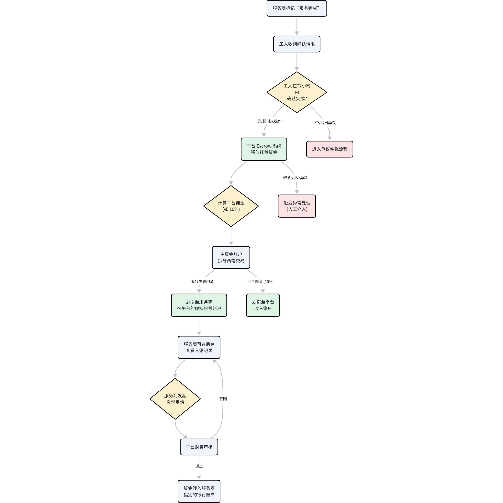
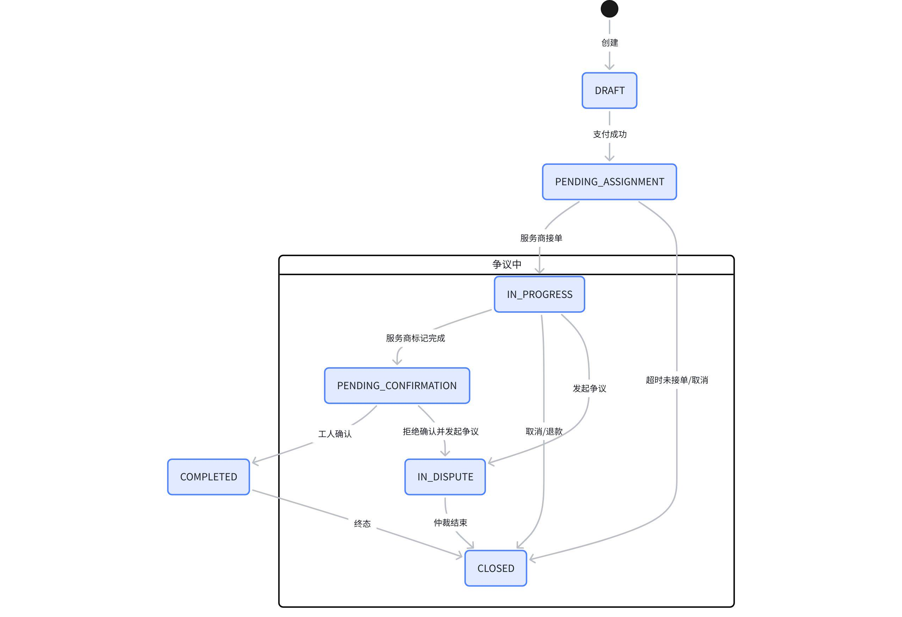

# 欧洲蓝领签证服务平台关键流程白板集
## 1. 注册登录与首启引导

**背景与意图**：此流程旨在为首次使用的蓝领工人提供一个极其简化的入门体验。考虑到目标用户可能存在语言障碍和对智能手机操作不熟练的情况，流程设计聚焦于最小化操作步骤和清晰的视觉引导。

**关键节点与交互**：

- **语言选择**：作为第一步，确保用户能在母语环境下进行操作。

- **验证码登录**：采用手机号/邮箱+验证码的方式，避免了复杂的密码设置与记忆负担。

- **错误处理**：对验证码错误、超时、网络异常等常见问题提供了明确的提示和重试路径，增强了流程的健壮性。

## 2. 申请创建与支付流程 (App视角)

**背景与意图**：此流程从工人的 App 视角，展示了从选择服务到最终成功创建“案件”的完整操作闭环。它与PRD中的业务总流程形成互补，更侧重于端内的用户交互与状态反馈。

**关键节点与交互**：

- **服务详情与预检**：在用户付款前，清晰展示服务内容、价格，并通过可选的“资格预检”帮助用户判断是否满足基本申请条件，减少无效申请。

- **收银台**：调用平台统一的收银台，提供标准、安全的支付体验。

- **即时反馈**：支付成功后，系统立刻给予“托管中”的安心提示，并自动跳转至进度追踪页面，让用户对下一步操作有明确预期。

## 3. 材料上传流程 (含OCR与质量校验)

**背景与意图**：材料准备是签证申请中最繁琐、最易出错的环节。此流程通过技术手段（OCR、图像质量校验）赋能，旨在简化工人上传材料的难度，并从源头提升材料质量，减轻后续服务商的审核压力。

**关键节点与交互**：

- **图像质量校验**：在用户拍照后即时进行“模糊、反光、边框不完整”等质量判断，从第一步就保证材料的可用性。

- **OCR预填充与人工确认**：自动识别关键字段并预填充，极大减少用户输入工作量。对“低置信度”的识别结果进行高亮，引导用户重点核对，实现了效率与准确性的平衡。

- **断点续传**：考虑到蓝领用户可能处于网络不佳的环境，断点续传机制保障了大文件上传的成功率。

## 4. 进度追踪与通知流程

**背景与意图**：信息不透明是传统签证服务的一大痛点。此流程旨在建立一个主动、清晰、可交互的进度同步机制，让工人始终对自己的申请状态了如指掌，缓解焦虑。

**关键节点与交互**：

- **Push推送**：当服务商更新进度时，系统通过推送通知主动触达用户，而非等待用户被动查询。

- **待办卡片**：在 App 内，将需要用户操作的节点（如补料）具象化为醒目的“待办卡片”，突出核心任务。

- **一键直达**：用户点击待办卡片后，可直接跳转至对应操作页面（如材料上传页），遵循“单页面只做一件事”的极简设计原则，路径最短、操作最简。

## 5. 平台派单与抢单流程

**背景与意图**：高效的案件分配机制是平台运转的核心。此流程结合了“智能派单”与“市场化抢单”，旨在实现案件分配效率与服务质量的最优化。

**关键节点与交互**：

- **定向派单**：新案件首先会根据服务商的等级、专业领域、负载情况，定向派给最优质的服务商，保证服务质量。

- **超时回流**：为避免案件积压，定向派单设有接单时限，超时后案件自动流入公开的“抢单池”，由市场机制调节。

- **SLA预警与重派**：对于长时间无人问津的案件，SLA监控系统会触发预警，通知运营人员介入，或自动提升案件优先级进行重派，为最终的服务履约提供兜底保障。

## 6. 收银台与PSD2/SCA/3DS挑战分支

**背景与意图**：作为在欧洲运营的平台，支付流程必须严格遵守PSD2法规中的强客户认证（SCA）要求。此流程（以时序图呈现）详细描绘了支付过程中，系统如何根据风险动态触发3DS验证，确保交易的合规性与安全性。

**关键节点与交互**：

- **风险评分**：支付网关在后台对每笔交易进行风险评估，这是决定是否需要额外验证的关键。

- **动态触发3DS**：仅在高风险交易时，才要求用户进行3DS身份验证（如输入短信码），在安全和用户体验之间取得了平衡。

- **清晰引导**：在需要用户进行额外验证或验证失败时，App界面会给予明确的页面展示和下一步操作指引。

## 7. 结算与分润流程

**背景与意图**：清晰、自动化的结算是维系平台与服务商信任关系的基础。此流程展示了当一笔服务完成之后，平台如何自动将托管资金进行清分、划拨，并支持服务商提现的完整资金链路。

**关键节点与交互**：

- **工人确认/超时确认**：结算流程由工人确认服务完成触发。为防止流程停滞，引入了“超时未操作则自动确认”的机制。

- **资金自动清分**：一旦确认，Escrow系统自动将总服务费按预设比例（如90%服务费，10%平台佣金）拆分到服务商的虚拟余额账户和平台收入账户，全程无需人工干预。

- **提现申请**：服务商可随时对其虚拟账户中的余额发起提现，经平台财务审核后即可到账，提供了灵活的资金管理能力。

## 8. CASE状态机

**背景与意图**：“案件（Case）”是贯穿整个业务流程的核心实体。此状态机图（State Diagram）直观地定义了一个案件从创建到终结可能经历的所有状态，以及状态之间合法的流转路径和触发条件。它是保障系统逻辑严谨性的基础。

**关键节点与交互**：

- **核心路径**：DRAFT -> PENDING_ASSIGNMENT -> IN_PROGRESS -> PENDING_CONFIRMATION -> COMPLETED -> CLOSED，展示了案件顺利完成的Happy Path。

- **异常/分支路径**：清晰地定义了如“超时未接单”、“发起争议”、“取消/退款”等情况下的状态迁移，确保了业务逻辑的完备性。

- **终态**：所有流程最终都会收敛到CLOSED状态，代表该案件生命周期的结束。

